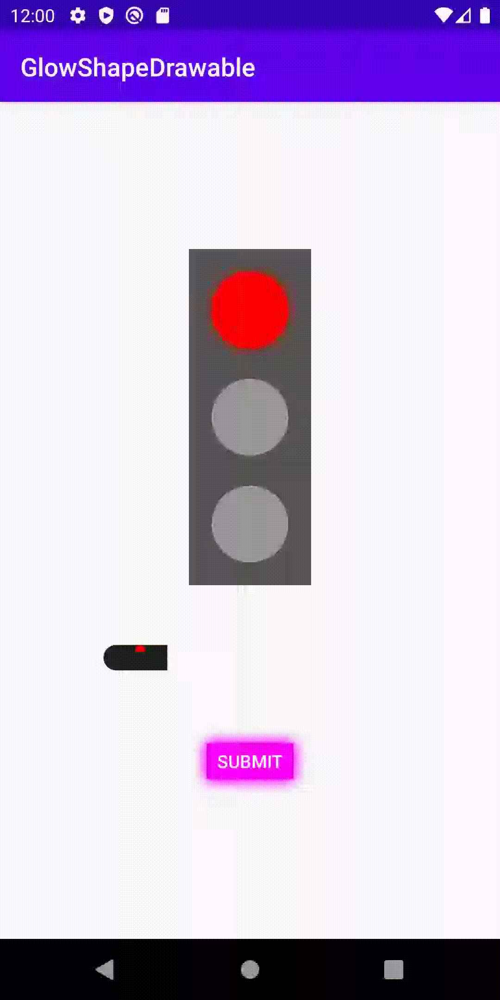

# GlowShapeDrawable

<div align="center">
    
</div>

# 💻 Setup

## Add it in your root build.gradle at the end of repositories

```gradle
    allprojects {
		repositories {
			...
			maven { url 'https://jitpack.io' }
		}
	}
```

## Add the dependency

```gradle
    dependencies {
	        implementation 'com.github.Vnicius:GlowShapeDrawable:1.0.0'
	}
```

# ⌨️ Usage

```kotlin
    val glowDrawable = GlowShapeDrawable()

    view.apply {
        setLayerType(View.LAYER_TYPE_SOFTWARE, glowDrawable.paint) // important
        background = glowDrawable
    }
```

# 🖌 Examples

- Background color file

```xml
    <!--res/color/background.xml-->

    <selector xmlns:android="http://schemas.android.com/apk/res/android">
        <item android:color="#ff0" android:state_selected="true" />
        <item android:color="#999" />
    </selector>
```

- Glow color file

```xml
    <!--res/color/glow.xml-->

    <selector xmlns:android="http://schemas.android.com/apk/res/android">
        <item android:color="#80ffff00" android:state_selected="true" />
        <item android:color="@android:color/transparent" />
    </selector>
```

- Using this

```kotlin
    val backgroundDrawable = GlowShapeDrawable().apply {
            backgroundColorList =
                ContextCompat.getColorStateList(context, R.color.background)
            glow = Glow(
                ContextCompat.getColorStateList(context, R.color.glow),
                context.resources.getDimension(R.dimen.glow_size).toInt()
            )
            cornerRadius = context.resources.getDimension(R.dimen.corner_radius) // optional
        }
```

- Or you can use with a single color

```kotlin
    val backgroundDrawable = GlowShapeDrawable().apply {
            backgroundColor = Color.GREEN
            glow = Glow(color = Color.RED,
                size = context.resources.getDimension(R.dimen.glow_size).toInt()
            )
        }
```

_Based on [GlowButton repository](https://github.com/SanojPunchihewa/GlowButton)_
